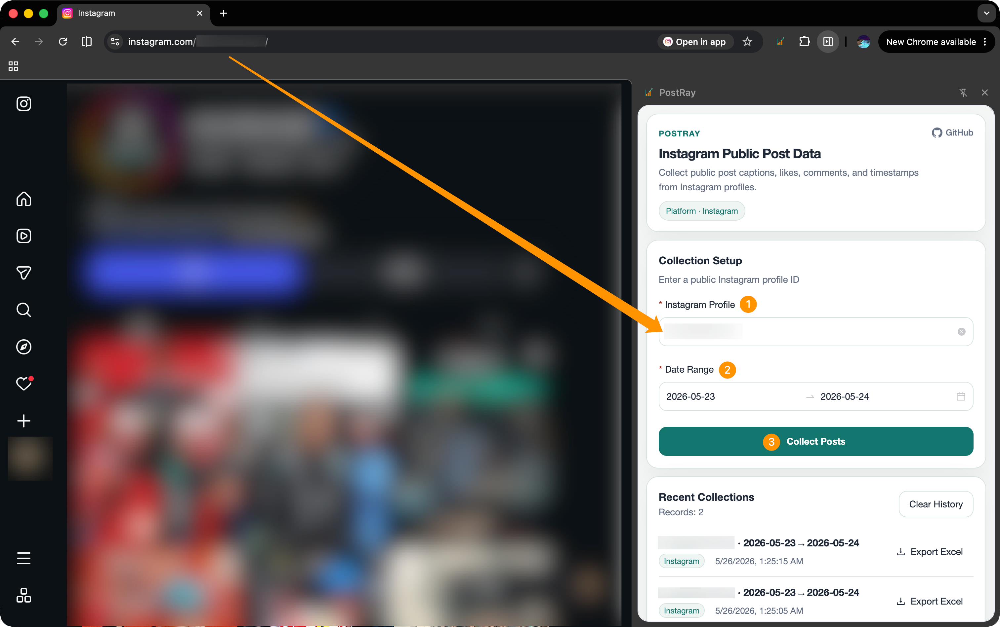
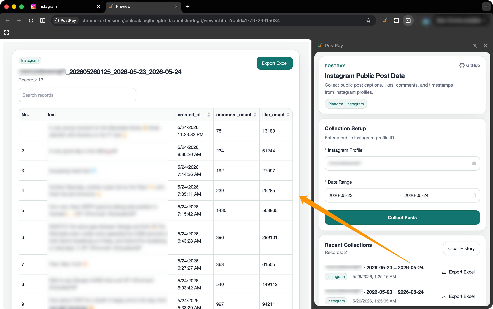

# PostRay

**PostRay** is a Chrome extension for collecting public Instagram post data (captions, likes, comments, timestamps) for personal learning and analysis.

**PostRay** 是一个 Chrome 插件，用于采集 Instagram 公开帖子的数据（文案、点赞数、评论数、发布时间），供个人学习和数据分析使用。

---

## Installation / 安装

1. Download the latest release ZIP from [Releases](https://github.com/Syueying/PostRay/releases)
2. Open Chrome → `chrome://extensions/` → Enable **Developer mode**
3. Click **Load unpacked** and select the extracted folder

---

1. 从 [Releases](https://github.com/Syueying/PostRay/releases) 下载最新版本的 ZIP 包
2. 打开 Chrome → 进入 `chrome://extensions/` → 开启右上角**开发者模式**
3. 点击**加载已解压的扩展程序**，选择解压后的文件夹

---

## Usage / 使用方法

1. Open any **public** Instagram profile page in Chrome
2. Click the PostRay icon in the toolbar to open the side panel
3. Enter the profile ID (the part after `instagram.com/`)
4. Select a date range
5. Click **Collect Posts** — PostRay will scroll through the profile and collect matching posts
6. When done, click **Export Excel** in the history list to download the data

---

1. 在 Chrome 中打开任意一个**公开**的 Instagram 主页
2. 点击工具栏中的 PostRay 图标，打开侧边栏
3. 输入主页 ID（即 `instagram.com/` 后面的部分）
4. 选择日期范围
5. 点击**开始采集** — PostRay 会自动滚动页面并收集符合条件的帖子
6. 采集完成后，在历史记录中点击**导出 Excel** 下载数据

---

## Preview / 效果预览

  
    
  

---

## Support / 支持作者

If this tool saved you time, feel free to buy me a coffee ☕

如果这个工具帮到了你，欢迎请我喝杯咖啡 ☕

<!-- QR code placeholder — replace with your actual payment QR image -->
<!-- 二维码占位符 — 替换为你实际的收款码图片 -->

  

---

## Legal Disclaimer / 免责声明

**EN:**
- PostRay only collects **publicly available** data from Instagram profiles. It does not bypass any login walls, paywalls, or private content restrictions.
- This tool is intended **for personal learning and data analysis only**. Any commercial use, bulk data resale, or use that violates Instagram's Terms of Service is strictly prohibited.
- The author assumes no responsibility for any consequences arising from misuse of this tool. Use at your own risk and in compliance with applicable laws and platform policies.
- Instagram's API and page structure may change at any time, which could cause this extension to stop working without notice.

**中文：**
- PostRay 仅采集 Instagram **公开可见**的帖子数据，不涉及任何登录绕过、付费墙破解或私密内容获取。
- 本工具**仅供个人学习与数据分析使用**，严禁用于商业目的、数据转售，或任何违反 Instagram 服务条款的行为。
- 因滥用本工具产生的任何法律责任或后果，作者概不承担，请在遵守当地法律法规及平台规则的前提下使用。
- Instagram 的接口和页面结构随时可能变更，届时本插件可能无法正常工作，恕不另行通知。

---

## Contact / 联系

GitHub: [https://github.com/Syueying/PostRay](https://github.com/Syueying/PostRay)

Issues & suggestions → [Open an Issue](https://github.com/Syueying/PostRay/issues)
